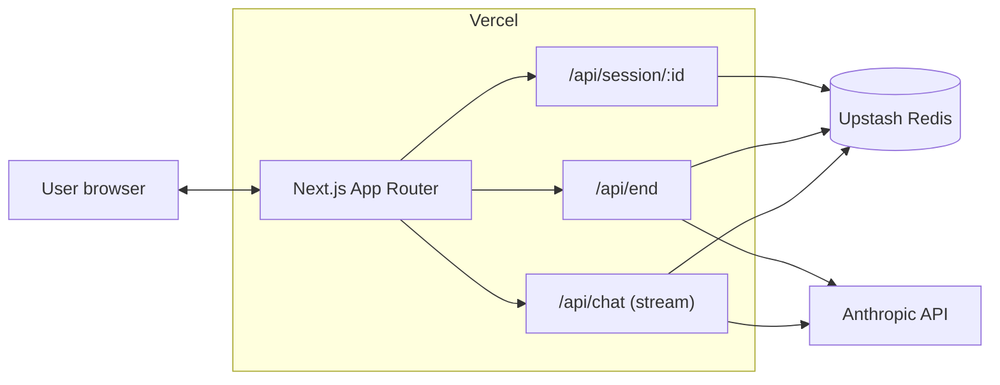
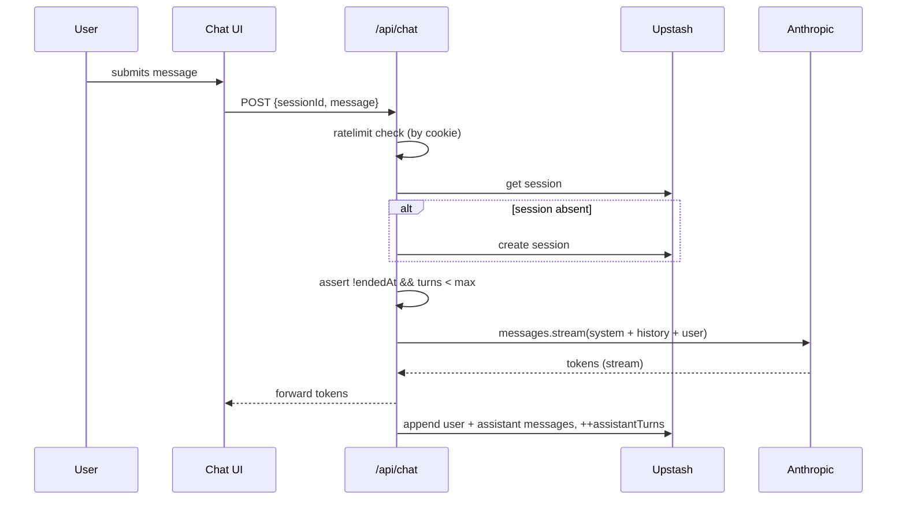

# Solution Architecture — Conversational Emotion Extraction

> Companion to `DECISIONS.md`. This document covers the **how**; `DECISIONS.md` covers the **why**.

## 1. Goals and non-goals

**Goals**
- Conduct a one-on-one English conversation with the user about their day (capped at ~8 assistant turns).
- On user request, analyze the transcript and surface negative emotions with supporting verbatim quotes from the user's messages.
- Be cheap to run, trivial to deploy, easy to defend in a 15-minute walkthrough.

**Non-goals**
- Authentication, accounts, conversation history UI.
- Per-turn real-time emotion classification.
- Therapy, advice, or crisis response beyond a fixed safety hand-off.
- Mobile-first design or visual polish.

## 2. High-level diagram



One Vercel deployment serves the UI and the API. State lives in Upstash Redis (REST). Anthropic Claude is the only model provider.

## 3. Components

| Component | Responsibility |
|---|---|
| `app/page.tsx` | Chat UI: message list, composer, "End conversation" button. |
| `app/result/[sessionId]/page.tsx` | Post-chat view with emotion cards and the neutral summary. |
| `app/api/chat` | Streams assistant reply, persists turns, enforces turn limit and rate limit. |
| `app/api/end` | Loads transcript, runs structured extraction, validates and persists result. Idempotent. |
| `app/api/session/[id]` | Read-only fetch of session and extraction, used by the result page. |
| `lib/llm/*` | Anthropic SDK wrappers: streaming chat and tool-use extraction. |
| `lib/prompts/*` | All prompts as version-controlled strings. First-class artifacts. |
| `lib/storage/*` | CRUD over Upstash Redis. |
| `lib/ratelimit.ts` | Per-cookie rate limit via `@upstash/ratelimit`. |
| `evals/` | Hand-written cases + a CLI runner that scores the extraction. |

## 4. Domain model

```ts
// lib/types.ts

export type SessionId = string; // uuid v4

export type Role = 'user' | 'assistant' | 'system';

export interface Message {
  id: string;        // uuid v4
  role: Role;
  content: string;
  createdAt: number; // unix ms
}

export interface Session {
  id: SessionId;
  createdAt: number;
  endedAt: number | null;
  messages: Message[];
  assistantTurns: number;
  maxAssistantTurns: number;
}

export const NEGATIVE_EMOTIONS = [
  'sadness',
  'anxiety',
  'frustration',
  'shame',
  'resentment',
  'disappointment',
  'anger',
  'burnout',
  'envy',
  'loneliness',
  'jealousy',
] as const;

export type EmotionLabel = typeof NEGATIVE_EMOTIONS[number];
export type Intensity = 'low' | 'mid' | 'high';

export interface EmotionFinding {
  label: EmotionLabel;
  intensity: Intensity;
  evidenceQuote: string;   // must be a verbatim substring of a USER message
  sourceMessageId: string; // id of the user message the quote came from
  rationale: string;       // one sentence justification
}

export interface ExtractionResult {
  sessionId: SessionId;
  emotions: EmotionFinding[];
  summary: string;         // 1–2 neutral sentences
  extractedAt: number;
  model: string;
  usage: { inputTokens: number; outputTokens: number; usdEstimate: number };
}
```

## 5. API contracts

### `POST /api/chat`
**Request**
```json
{ "sessionId": "uuid or omitted on first turn", "message": "..." }
```
**Response**
- `200 OK`, `text/event-stream`. Body: streamed assistant tokens.
- Side effects: create session if absent, append user message, append assistant message after stream completes, increment `assistantTurns`.
- Errors: `429` rate-limited, `403` session already ended, `400` validation failure.

### `POST /api/end`
**Request**
```json
{ "sessionId": "..." }
```
**Response**
```json
{ "extraction": "ExtractionResult" }
```
- Idempotent: if `extraction:{id}` exists, return it unchanged.

### `GET /api/session/:id`
**Response**
```json
{ "session": "Session", "extraction": "ExtractionResult | null" }
```

## 6. Key flows

### 6.1 Chat turn



### 6.2 End conversation / extraction

```mermaid
sequenceDiagram
  participant U as User
  participant UI as Chat UI
  participant API as /api/end
  participant KV as Upstash
  participant LLM as Anthropic
  U->>UI: clicks "End conversation"
  UI->>API: POST {sessionId}
  API->>KV: get session
  alt extraction already cached
    API-->>UI: cached ExtractionResult
  else
    API->>LLM: messages.create with tool report_emotions
    LLM-->>API: tool_use call with args
    API->>API: validate every quote is a substring of a user message; drop bad findings
    API->>KV: set extraction:{id}, set session.endedAt
    API-->>UI: ExtractionResult
  end
  UI->>U: redirect /result/{sessionId}
```

## 7. Prompts

Prompts are treated as production artifacts. They live in `lib/prompts/`, are imported as strings, and changes are reviewed like code.

### 7.1 `lib/prompts/system.ts`
- Role: empathetic listener helping the user articulate how their day went.
- Behavior: one open question per turn, mirror feelings, do not diagnose, do not give advice unless asked, no moralizing, plain language.
- Wrap-up trigger: when `assistantTurns >= maxAssistantTurns - 1`, gently invite the user to wrap up.
- Safety: if the user signals self-harm or crisis, switch to a static safe hand-off and stop probing.

### 7.2 `lib/prompts/extraction.ts`
- Used as a single `messages.create` call with `tools=[report_emotions]` and `tool_choice` forced to that tool.
- Tool input schema: `{ emotions: EmotionFinding[], summary: string }`.
- Hard rules in the prompt:
  - Allowed labels come from `lib/prompts/emotions.ts` and nothing else.
  - Every `evidenceQuote` must be a verbatim substring of a **user** message.
  - Return an empty array if no negative emotion is clearly supported.
  - Intensity: `low` = passing mention, `mid` = clearly stated, `high` = sustained or vivid.
  - One-sentence rationale per finding.

### 7.3 `lib/prompts/emotions.ts`
- Single source of truth for the label list with one-line definitions. Re-used both in the extraction prompt and as captions in the result UI.

## 8. Storage

Upstash Redis via the REST client, keyed as:

| Key | Value | TTL |
|---|---|---|
| `session:{sessionId}` | `Session` JSON | 7 days |
| `extraction:{sessionId}` | `ExtractionResult` JSON | 7 days |
| `ratelimit:{cookieId}` | counter (handled by `@upstash/ratelimit`) | 1 hour |

No relational queries. No PII beyond conversation content. TTL guarantees a quiet cleanup with no data-retention workflow needed for a prototype.

## 9. Cost and limits

- **Chat model**: `claude-haiku-4-5-20251001`. Streaming on.
- **Extraction model**: `claude-haiku-4-5-20251001` by default; switch to `claude-sonnet-4-6` via env if eval results justify the cost.
- **Per-conversation budget target**: under $0.01 end to end.
- **Turn cap**: 8 assistant turns.
- **Rate limit**: 10 conversations per anonymous cookie per hour; 200 per IP per day.
- **Provider-side ceiling**: hard monthly spend limit on the Anthropic API key, set in the console.

## 10. Security

- API keys server-side only; never reach the client.
- Anonymous session cookie (`HttpOnly`, `SameSite=Lax`) carries an opaque uuid.
- User input is treated as content, never re-injected as system instructions (no prompt-from-user pathway).
- Crisis hand-off message is a fixed string, not model-generated.
- No execution of tool calls beyond `report_emotions`. The tool layer is intentionally read-only.

## 11. Observability

- Per-request log line: `{ route, sessionId, latencyMs, inputTokens, outputTokens, usdEstimate }`. Vercel function logs are sufficient at this scale.
- The result view shows a cost badge derived from `ExtractionResult.usage` — handy during the walkthrough.

## 12. Evaluation harness (`evals/`)

- `cases.json`: 10–15 hand-written transcripts with expected emotion labels.
- `run.ts`: feeds each transcript through the **same** extraction code path as production and computes:
  - label-set precision, recall, macro F1
  - share of findings whose `evidenceQuote` is a real substring of the transcript
  - mean USD cost per case
- Run with `pnpm eval`. Output to `evals/last-run.json`. Headline numbers maintained by hand in `EVALS.md`.

## 13. Project structure

```
.
├── app/
│   ├── layout.tsx
│   ├── page.tsx                      # chat
│   ├── globals.css
│   ├── result/
│   │   └── [sessionId]/page.tsx      # extraction view
│   └── api/
│       ├── chat/route.ts
│       ├── end/route.ts
│       └── session/[id]/route.ts
├── components/
│   ├── Chat.tsx
│   ├── MessageList.tsx
│   ├── Composer.tsx
│   ├── EndButton.tsx
│   └── EmotionCard.tsx
├── lib/
│   ├── llm/
│   │   ├── client.ts
│   │   ├── chat.ts
│   │   └── extract.ts
│   ├── prompts/
│   │   ├── system.ts
│   │   ├── extraction.ts
│   │   └── emotions.ts
│   ├── storage/
│   │   ├── kv.ts
│   │   └── sessions.ts
│   ├── ratelimit.ts
│   ├── cost.ts
│   ├── session-cookie.ts
│   └── types.ts
├── evals/
│   ├── cases.json
│   ├── run.ts
│   └── last-run.json
├── public/
├── .env.example
├── .gitignore
├── DECISIONS.md
├── EVALS.md
├── README.md
├── SA.md
├── next.config.ts
├── package.json
├── pnpm-lock.yaml
├── postcss.config.mjs
├── tailwind.config.ts
└── tsconfig.json
```

## 14. Initial dependencies

- `next` (App Router, ≥15), `react`, `react-dom`, `typescript`
- `@anthropic-ai/sdk`
- `@upstash/redis`, `@upstash/ratelimit`
- `zod`
- `uuid`
- `tailwindcss`, `@tailwindcss/postcss`
- Dev: `tsx` (to run `evals/run.ts`), `eslint`, `@types/uuid`